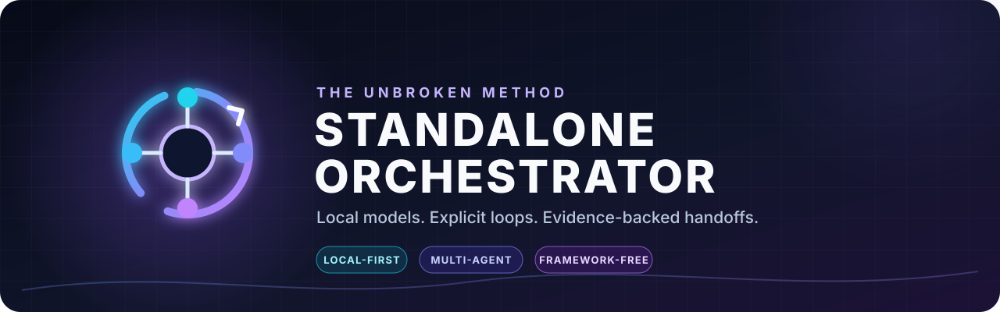
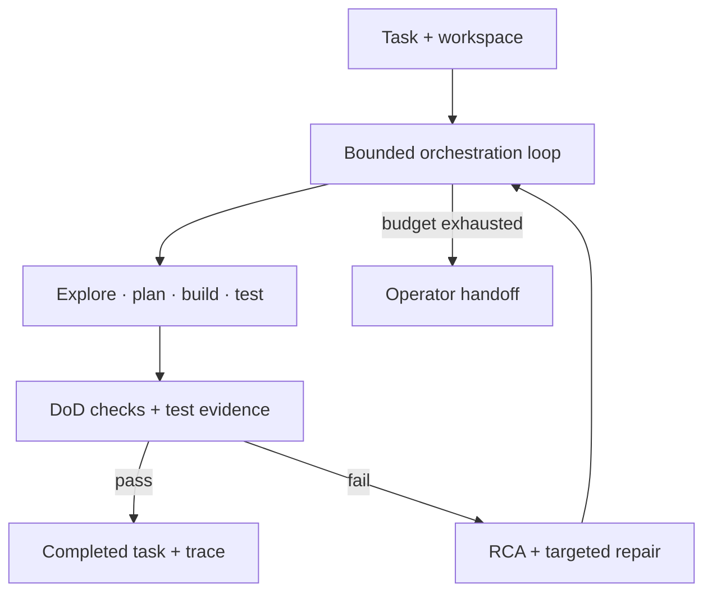

<p align="center">
  
</p>

<p align="center">
  <a href="https://github.com/TenchiNeko/standalone-orchestrator/actions/workflows/ci.yml"></a>
  
  <a href="LICENSE"></a>
  <a href="BENCHMARKS.md"></a>
  
</p>

<p align="center"><strong>A framework-free Python orchestrator for bounded, multi-agent coding workflows across local language models.</strong></p>

<p align="center">
  <a href="#why-this-project">Why this project</a> ·
  <a href="#latest-benchmark-v122">Benchmarks</a> ·
  <a href="#architecture">Architecture</a> ·
  <a href="#quick-start">Quick start</a> ·
  <a href="#design-philosophy">Design</a>
</p>

Standalone Orchestrator turns a task description into an explicit plan → build → test → root-cause-analysis loop. Each run is bounded by an iteration limit; successful work produces verification evidence, while unresolved work ends with a handoff instead of looping forever.

The checked-in configuration is local-first and routes work directly to Ollama. The control loop, prompts, routing, repair logic, session state, and trace collection remain visible Python rather than being hidden behind an agent framework.

> [!IMPORTANT]
> This is an experimental coding system that can write files and run commands inside the workspace you give it. Start in an isolated repository, review the generated diff, and keep credentials out of the task environment.

## Why this project

| Design choice | What it provides |
| --- | --- |
| **Explicit control flow** | Planning, candidate generation, testing, repair, and escalation are readable code paths. |
| **Local-first routing** | Default agent profiles use Ollama endpoints on hardware you control. |
| **Bounded execution** | Iteration limits and verification gates prevent silent, unbounded retry loops. |
| **Evidence over confidence** | Definition-of-Done checks, test output, traces, and handoffs record what actually happened. |
| **Small dependency surface** | The runtime is primarily Python's standard library plus `httpx`. |
| **Inspectable learning loop** | Optional librarian, RAG, trace, playbook, and self-play components stay separable from execution. |

## Latest benchmark (v1.2.2)

```
🏁 Running 5 benchmark task(s)...

Task 1: Calculator (Level 2)             → ✅ PASS  5/5 tests,   1 iter,  7m
Task 2: Miniqueue (Level 3)              → ✅ PASS  16/16 tests, 2 iter, 39m
Task 3: Task Tracker CLI (Level 4)       → ✅ PASS  37/39 tests, 1 iter, 45m
Task 4: Bookmark Manager API (Level 5)   → ✅ PASS  73/86 tests, 2 iter, 41m
Task 5: Expense Tracker + Auth (Level 6) → ✅ PASS  86/103 tests, 1 iter, 61m
```

5/5 tasks passing — 217/249 tests (87%). All DoD criteria met across every level. The system handles everything from simple classes to complex multi-file REST APIs with JWT auth, budget limits, and CSV export — fully autonomously on local hardware.

```
Task: "Build a task tracker CLI with JSON persistence..."

ITERATION 1
├─ EXPLORE    → Analyze requirements, identify patterns
├─ PLAN       → Generate DoD criteria with verification commands
├─ BUILD      → Sequential micro-builds with multi-candidate sampling
│  ├─ models.py      ✅ (1st candidate, temp=0.0)
│  ├─ database.py    ✅ (1st candidate, temp=0.0)
│  ├─ cli.py         ✅ (2nd candidate, temp=0.4)
│  ├─ test_models.py ✅ (1st candidate, 12/12 tests pass)
│  └─ test_cli.py    ⚠️  (best of 4: 28/30 → edit repair)
└─ TEST       → DoD verification: 5/7 criteria passed

ITERATION 2 (dependency-aware retry)
├─ RCA        → "cli.py missing --format flag for list command"
├─ BUILD      → Rebuild cli.py + cascade dependents
└─ TEST       → 7/7 DoD, 36/38 tests

ITERATION 3 (targeted edit repair)
├─ EDIT REPAIR → Structured JSON schema → 2 surgical fixes
└─ TEST       → ✅ ALL 38/38 TESTS PASS

🎉 TASK COMPLETED SUCCESSFULLY (3 iterations, 21 minutes)
```

---

## Architecture



### Reference deployment

The repository defaults reflect the multi-GPU Ollama deployment used for the recorded benchmarks. Model IDs, endpoints, roles, and context budgets are configurable.

```text
Cortana (Dell 7920) — 4x GPU, 64GB VRAM
┌─────────────────────────────────────────────────────────────┐
│                                                             │
│  Instance 1 (port 11435)          Instance 2 (port 11436)   │
│  Qwen3-Coder-Next 80B MoE        Qwen 2.5 Coder 7B/14B    │
│  GPUs 1+2+3 (48GB VRAM)          GPU 0 (16GB)              │
│  ┌──────────┐ ┌──────────┐       ┌──────────┐              │
│  │ Planner  │ │ Builder  │       │ Explorer │              │
│  │ /think   │ │ /think   │       │ /no_think│              │
│  │ (reason) │ │ (code)   │       │ Init     │              │
│  └──────────┘ └──────────┘       │ Tester   │              │
│        │            │            │ Librarian│              │
│        ▼            ▼            └──────────┘              │
│  ┌──────────────────────────────────────────┐              │
│  │         standalone_orchestrator.py        │              │
│  │  Plan → Build → Test → RCA → Retry       │              │
│  │  AST sigs │ Import graphs │ DoD │ AST-RAG│              │
│  └──────────────────────────────────────────┘              │
│        │                                                    │
│  ┌─────┴─────┐  ┌──────────┐  ┌──────────────┐            │
│  │ RAG KB    │  │ Librarian│  │ Trace        │            │
│  │ 81 pats   │  │ AST-RAG  │  │ Collector    │            │
│  │ 15K docs  │  │ Journal  │  │ Self-Play    │            │
│  └───────────┘  └──────────┘  └──────────────┘            │
└─────────────────────┬───────────────────────────────────────┘
                      │ rsync (auto-sync after each run)
                      ▼
PVE Node (homeserver) — Qwen 2.5 Coder 7B
┌─────────────────────────────────────────────────────────────┐
│  Subconscious Daemon (24/7)                                 │
│  ┌──────────┐  ┌──────────┐  ┌──────────┐                  │
│  │ Analyze  │→ │ Reflect  │→ │ Curate   │                  │
│  │ sessions │  │ patterns │  │ playbook │                  │
│  └──────────┘  └──────────┘  └──────────┘                  │
│        │                           │                        │
│        ▼                           ▼                        │
│  Training pairs              playbook.json ──→ Cortana      │
│  (LoRA fine-tuning)          (injected into agent prompts)  │
└─────────────────────────────────────────────────────────────┘
```

Both Ollama instances run simultaneously — **no model swapping**. The 80B handles planning and code generation while the 7B/14B handles exploration, testing, and curation in parallel.

---

## How It Works

### The Loop

Each task runs through up to N iterations (default 3). Each iteration:

1. **EXPLORE** — Scan the workspace, identify existing code and patterns
2. **PLAN** — Generate Definition of Done (DoD) criteria with concrete verification commands
3. **BUILD** — Sequential micro-builds with multi-candidate sampling per file
4. **TEST** — Run all tests, verify DoD criteria
5. **RCA** — If tests fail, perform 5-Whys Root Cause Analysis with concrete edit suggestions
6. **RETRY** — Rebuild only the broken files + their dependents (cascade-aware)

### Multi-Candidate Sampling

Each file gets multiple candidates at different temperatures. The orchestrator picks the best one by score:

| Source files | Test files |
|---|---|
| 3 candidates (temp 0.0, 0.4, 0.8) | 4 candidates (temp 0.3, 0.6, 0.8, 1.0) |
| Score = compiles + imports + exports match | Score = tests passing / total tests |

If no candidate is perfect, **Wave 2** kicks in: error-aware re-sampling that includes the specific errors from Wave 1 in the prompt.

### Edit Repair (v1.2: Grammar-Constrained)

For files where the best candidate has most tests passing but a few failures, the orchestrator uses surgical fixes. As of v1.2, edit repair uses **grammar-constrained structured output** — a JSON schema that guarantees 100% well-formed edits from the LLM, eliminating the 15-20% malformation rate of free-text SEARCH/REPLACE parsing.

The system tries structured JSON repair first, and automatically falls back to text-based SEARCH/REPLACE if the model doesn't support the `format` parameter. Up to 3 rounds of iterative repair per file.

Small files (<80 lines) skip edit repair and go straight to whole-file regeneration — it's faster and more reliable for short files.

### Dependency-Aware Cascade Rebuilds

The orchestrator builds an **AST-based import dependency graph** at retry time:

```
models.py ← database.py ← app.py
              ↑               ↑
         validators.py    test_app.py
```

When `database.py` is identified as the root cause, the orchestrator automatically rebuilds `app.py`, `test_database.py`, and `test_app.py` too — preventing stale dependency failures.

### AST-Based Signature Extraction

Instead of dumping full source files into the manifest (context rot for small models), the orchestrator extracts **compact API contracts** using Python's `ast` module:

```
models.py exports:
  Bookmark(id, url, title, tags=..., created_at=...)

database.py exports:
  BookmarkDB[__init__(db_path=...), .get_all(page=..., tag=...), .delete(bookmark_id)]
  init_db(), get_db()
```

This gives the model exact function signatures and constructor parameters in ~200 tokens instead of ~9,000 tokens of full source.

---

## v1.2 Inference Optimizations

v1.2 implements 7 optimizations drawn from 2025-2026 local LLM research:

| Optimization | Source | Impact |
|---|---|---|
| Grammar-constrained structured output | Ollama `format` parameter | 100% well-formed edits (was 80-85%) |
| Thinking tokens (/think, /no_think) | Qwen3 native, budget forcing research | Better reasoning for plan/build agents |
| Repetition penalty disabled (1.0) | Stepfunction / r/LocalLLaMA | Qwen-Next very sensitive to penalties |
| Nucleus sampling (top_p=0.95) | Qwen recommended params | Better sampling diversity |
| AST-aware RAG chunking | cAST research (+4.3 Recall@5) | Semantic code chunks for retrieval |
| Self-play training data collection | Sol-Ver, SICA research | JSONL pairs for QLoRA fine-tuning |
| Speculative decoding support | Ollama server-side config | Configurable draft model for faster inference |

All optimizations are configurable via JSON config overrides or environment variables. Each has a kill switch if issues arise in production.

---

## File Reference

### Core Orchestrator (13,245 lines total)

| File | Lines | Purpose |
|------|-------|---------|
| `standalone_main.py` | 132 | CLI entry point. Parses args, loads config, starts orchestrator |
| `standalone_orchestrator.py` | 4,655 | Main loop: plan → build → test → RCA → retry. Multi-candidate sampling, edit repair, AST signatures, import graphs, cascade rebuilds, self-play data collection |
| `standalone_agents.py` | 4,944 | Agent implementations. Ollama HTTP client, tool-use parsing, structured output, thinking token injection |
| `standalone_config.py` | 302 | Dual-instance Ollama config. Model routing, GPU assignments, inference optimization parameters |
| `standalone_models.py` | 196 | Data models: `AgentResult`, `TaskState`, `BuildStep` |
| `standalone_session.py` | 134 | Session state persistence (JSON) |
| `standalone_memory.py` | 197 | Cross-session memory management |
| `standalone_trace_collector.py` | 468 | Records build/test/RCA failures as structured JSONL for analysis |
| `kb_client.py` | 317 | RAG Knowledge Base client (port 8787) |
| `librarian.py` | 693 | Post-session curation using 7B model |
| `librarian_store.py` | 696 | SQLite storage + AST-aware code chunking |
| `playbook_reader.py` | 181 | Reads evolving playbook from subconscious daemon |
| `benchmark.py` | 343 | Standardized 5-task benchmark suite |

### Agent Prompts

| File | Role | Model |
|------|------|-------|
| `prompts/initializer.txt` | Set up workspace, git repo, venv | 7B/14B |
| `prompts/explore.txt` | Analyze requirements and patterns | 7B/14B |
| `prompts/plan.txt` | Generate DoD criteria | 80B (/think) |
| `prompts/build.txt` | Generate source code | 80B (/think) |
| `prompts/build_markdown.txt` | Alternative build format | 80B |
| `prompts/test_gen.txt` | Generate test files against spec | 80B |
| `prompts/test.txt` | Run tests, report results | 7B/14B (/no_think) |
| `prompts/edit_repair.txt` | Surgical SEARCH/REPLACE fixes | 80B |

### Subconscious Daemon (runs on PVE node)

| File | Purpose |
|------|---------|
| `subconscious-daemon/daemon.py` | Main loop with priority queue |
| `subconscious-daemon/config.py` | Daemon configuration |
| `subconscious-daemon/playbook.py` | ACE-style evolving playbook |
| `subconscious-daemon/ollama_client.py` | Async Ollama HTTP client |
| `subconscious-daemon/session_scanner.py` | Watches for completed sessions |
| `subconscious-daemon/deploy.sh` | systemd service installer |
| `subconscious-daemon/seed_playbook.py` | Pre-load known patterns |

---

## The Knowledge Stack

Four layers of accumulated knowledge, each operating at a different timescale:

### Layer 1: RAG Knowledge Base (static, curated)
- **81 error→solution patterns** extracted from past failures
- **15,500+ documentation chunks** (CPython, Flask, pytest, sqlite3, dataclasses)
- Queried per-file during builds
- Runs as a systemd service on port 8787

### Layer 2: Librarian (per-session, 7B curator)
- Runs after each session completes (success or failure)
- Extracts **journal entries** (lessons learned) and **code snippets** (reusable patterns)
- **v1.2:** AST-aware code chunking stores semantic function/class chunks for retrieval
- Stored in persistent SQLite

### Layer 3: Subconscious Daemon (continuous, cross-session)
- Runs 24/7 on a separate node with its own 7B model
- Implements the **ACE (Agentic Context Engineering)** framework
- Maintains an evolving **playbook** of bullet-point heuristics with helpful/harmful scoring

### Layer 4: Self-Play Training Data (v1.2)
- On successful task completion, saves (requirement → code) pairs as JSONL
- Auto-categorizes by domain (web_api, cli, database, testing, scraping, etc.)
- Ready for QLoRA fine-tuning with Unsloth

---

## Hardware Requirements

### Minimum (single GPU)
- 1x GPU with 24GB+ VRAM (RTX 3090, RTX 4090)
- Single Ollama instance with a 14B-34B model
- Point both roles at the same endpoint in `standalone_config.py`

### Recommended (multi-GPU, as built)

```
Cortana (Dell 7920 Workstation)
├─ GPU 0: RTX 5060 Ti 16GB  → Ollama Instance 2 (port 11436) → Qwen 2.5 Coder 7B
├─ GPU 1: RTX 3090 24GB     → Ollama Instance 1 (port 11435) → Qwen3-Coder-Next 80B
├─ GPU 2: RTX 4070 Super 12GB → Ollama Instance 1 (tensor parallel)
├─ GPU 3: RTX 4070 Super 12GB → Ollama Instance 1 (tensor parallel)
└─ Total: 64GB VRAM, no model swapping

PVE Node (homeserver)
└─ Any GPU with 8GB+ → Ollama → Qwen 2.5 Coder 7B → Subconscious daemon
```

---

## Quick start

### 1. Install the project

```bash
git clone https://github.com/TenchiNeko/standalone-orchestrator.git
cd standalone-orchestrator

python3 -m venv .venv
source .venv/bin/activate
python -m pip install -r requirements.txt
```

### 2. Set up Ollama instances

```bash
# Instance 1: Heavy reasoning (80B)
CUDA_VISIBLE_DEVICES=1,2,3 OLLAMA_HOST=0.0.0.0:11435 ollama serve

# Instance 2: Fast agents (7B/14B)
CUDA_VISIBLE_DEVICES=0 OLLAMA_HOST=0.0.0.0:11436 ollama serve

# Pull models
OLLAMA_HOST=localhost:11435 ollama pull qwen3-coder-next
OLLAMA_HOST=localhost:11436 ollama pull qwen2.5-coder:7b
```

### 3. Optional: start the RAG knowledge base

```bash
sudo systemctl start rag-kb    # Reference deployment: port 8787
```

The knowledge-base client has a local fallback, so it is not required for the first run.

### 4. Run a task

```bash
python3 standalone_main.py \
  "Build a bookmark manager REST API with Flask. Features: add/remove/update bookmarks
   with URL, title, tags. Search by tag. Pagination. Input validation. SQLite storage." \
  --max-iterations 3 \
  --working-dir /tmp/bookmark-test
```

### 5. Run project checks or benchmarks

```bash
make test               # 87 deterministic v1.2 stress checks
make lint
make typecheck

make benchmark          # Full suite (5 tasks, ~2-3 hours)
make benchmark-quick    # Level 2 only (~20 min)
python3 benchmark.py --task 4   # Single task
```

---

## Design Philosophy

This project follows the **library approach** — not the framework approach. There are no base classes to inherit from, no decorators to register agents, no YAML-driven pipelines. The orchestrator is a Python script that calls Ollama's HTTP API directly.

- **Full control over execution flow.** When the model generates broken JSON, we handle it. When a file needs 5 retries at different temperatures, we control that loop.
- **No dependency rot.** Python stdlib + httpx. That's it.
- **Debuggable.** Read the Python code and the Ollama logs. No framework magic.
- **Portable.** Swap Ollama for vLLM, llama.cpp, or any OpenAI-compatible API by changing one URL.

---

## Key Techniques

| Technique | Source | Implementation |
|-----------|--------|----------------|
| Multi-candidate sampling | Aider, AlphaCode | Temperature sweep per file, best-of-N selection |
| AST-based repo maps | Aider (tree-sitter) | `_extract_signatures_ast()` in orchestrator |
| Import dependency graphs | Custom | `_build_import_graph()` + `_get_dependents()` |
| Grammar-constrained output | Ollama structured output | `EDIT_REPAIR_SCHEMA` JSON schema for edits |
| Thinking tokens | Qwen3 /think, budget forcing | Per-agent injection in `_run_agent()` |
| AST-aware RAG | cAST research | `chunk_python_ast()` in librarian_store |
| Spec-anchored TDD | EvalPlus, TiCoder | Tests written against task spec, not source |
| Self-play data collection | Sol-Ver, SICA | JSONL pairs for QLoRA fine-tuning |
| Localization → Repair → Validation | Agentless (UIUC) | RCA → targeted rebuild → verify |
| ACE playbook evolution | Stanford/SambaNova | Subconscious daemon with quality tracking |
| Architect/Editor split | Aider | 80B reasons, 7B/14B executes |

---

## Version History

| Version | Date | Highlights |
|---------|------|------------|
| v1.2.2 | 2026-02-17 | Hotfix: restored f-string prompts, Ollama options, thinking mode (v1.2.1 regressions) |
| v1.2.1 | 2026-02-16 | httpx migration, path traversal guard, per-task iteration limits |
| v1.2 | 2026-02-15 | Inference optimizations: structured edits, thinking tokens, AST-RAG, self-play |
| v1.1c | 2026-02-14 | Fixed num_ctx bug (128K→2K truncation), branch audit, 4 critical bug fixes |
| v1.0c | 2026-02-14 | First 8/8 DoD pass on Level 5. Cascade rebuilds, RCA working end-to-end |
| v0.9.9 | 2026-02-13 | Multi-candidate sampling, edit repair, Wave 2 re-sampling |
| v0.6.x | 2026-02-12 | Trace collector, snapshot protection, error-aware sampling |
| v0.5.x | 2026-02-10 | Post-build verification redesign, context budgets, RCA evidence |
| v0.4.x | 2026-02-08 | Structured output, 5-Whys RCA, micro-build architecture |
| v0.3.0 | 2026-02-06 | Standalone system (no opencode dependency), direct Ollama API |

See [BENCHMARKS.md](BENCHMARKS.md) for detailed results and [ROADMAP.md](ROADMAP.md) for what's next.

---

## License

MIT License — see [LICENSE](LICENSE) for details.

*Built with patience, mass quantities of GPU hours, and zero framework dependencies by [@TenchiNeko](https://github.com/TenchiNeko).*

### Keywords

`autonomous-coding` `ai-agents` `local-llm` `ollama` `multi-agent` `code-generation` `self-improving` `test-driven` `no-framework` `multi-gpu` `qwen` `agentic` `orchestrator` `swe-bench` `ace-framework`
